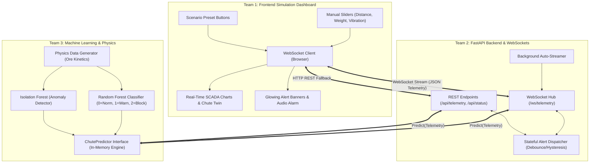

# 🏗️ FlowSentinel: Comprehensive Project Plan & Phased Execution Blueprint

**System**: AI-Powered Intelligent Chute Blockage & Anomaly Detection System  
**Deployment Context**: High-stress industrial conveyor & transfer chutes (e.g., steel manufacturing plants).  
**Engineering Team Composition**: 6 Software Engineers (3 Sub-Teams of 2 Engineers each).

---

## 1. Executive Summary & Problem Context
In heavy industrial steel plants, raw materials (iron ore, limestone, sintered pellet, coal) travel through gravity-fed transfer chutes. Frequent choke incidents and structural blockages cause catastrophic conveyor motor burnout, material spillage, and expensive unplanned downtime costing \$15,000+ per hour.

**FlowSentinel** is an intelligent early-warning detection system leveraging 3 logical sensor streams:
1. **Ultrasonic Clearance Sensor (Distance $d$ cm)**: Measures the air gap above the material stream down to the bed.
2. **HX711 Strain Gauge Load Cell (Weight $W$ kg)**: Measures the continuous static/dynamic burden of the chute.
3. **MPU6050 Tri-Axial Accelerometer (Vibration $G$ RMS)**: Measures material collision energy and mechanical oscillation.

To overcome physical hardware testing constraints, the architecture includes a high-fidelity **Manual & Automated Simulation GUI** that streams physics-based telemetry directly to the backend and machine learning inference pipeline.

---

## 2. Team Division, Roles & Responsibilities

```
                          ┌─────────────────────────────────────────┐
                          │         SYSTEM ARCHITECT / PM           │
                          └───────────────────┬─────────────────────┘
                                              │
        ┌─────────────────────────────────────┼─────────────────────────────────────┐
        │                                     │                                     │
        ▼                                     ▼                                     ▼
┌───────────────────────┐           ┌───────────────────────┐           ┌───────────────────────┐
│        TEAM 1         │           │        TEAM 2         │           │        TEAM 3         │
│   Frontend & UI/UX    │           │ Backend & WebSockets  │           │  ML & Physics Sim     │
│   (Engineers 1 & 2)   │           │   (Engineers 3 & 4)   │           │   (Engineers 5 & 6)   │
├───────────────────────┤           ├───────────────────────┤           ├───────────────────────┤
│ • Simulation Panel    │           │ • FastAPI Core Engine │           │ • Physics Generator   │
│ • Live SCADA Gauges   │◄─────────►│ • WebSocket Hub       │◄─────────►│ • Isolation Forest    │
│ • Charts & Timelines  │           │ • Alert Dispatcher    │           │ • Random Forest       │
│ • Alarm Banners & Log │           │ • REST Telemetry API  │           │ • ChutePredictor PKL  │
└───────────────────────┘           └───────────────────────┘           └───────────────────────┘
```

### Team 1: Frontend & Simulation GUI (Engineers 1 & 2)
- **Primary Goal**: Build an industrial-grade, ultra-responsive web dashboard with real-time visualization and simulation controls.
- **Key Responsibilities**:
  1. **Engineer 1 (UI/UX & Simulation Controls)**:
     - Develop interactive sliders for Distance ($0-150\text{ cm}$), Load Weight ($0-1500\text{ kg}$), and Vibration ($0-10\text{ G}$).
     - Create quick scenario preset buttons (`Optimal Flow`, `Rising Buildup`, `Complete Jam`, `Sensor Fault`).
     - Build bidirectional WebSocket client handling throttled slider events and auto-simulation switches.
  2. **Engineer 2 (SCADA Visualizations & Alarms)**:
     - Build real-time multi-metric time-series charts using Chart.js / Canvas.
     - Implement dynamic SCADA-style Chute Digital Twin widget (live cross-section showing material accumulation).
     - Build audio-visual alarm indicators, severity banners, and historical event logs.

### Team 2: Backend & WebSockets (Engineers 3 & 4)
- **Primary Goal**: Architect a high-throughput, low-latency async API server that bridges the simulation UI with ML models.
- **Key Responsibilities**:
  1. **Engineer 3 (FastAPI Core & Telemetry Pipeline)**:
     - Implement FastAPI application lifecycle, Pydantic data validation schemas, and REST endpoints (`/api/telemetry`, `/api/status`, `/api/presets`).
     - Integrate Team 3's `ChutePredictor` model pipeline with sub-20ms inference latency.
     - Create automated headless background simulator service for continuous streaming.
  2. **Engineer 4 (WebSocket Hub & Alert Management)**:
     - Build robust async WebSocket Connection Manager supporting multiple concurrent frontend observers.
     - Implement stateful Alert Dispatcher with hysteresis/debouncing (prevents alarm flapping between Warning and Blockage).
     - Write integration test suite (`pytest`, `httpx`) and Docker containerization.

### Team 3: Machine Learning & Physics Simulation (Engineers 5 & 6)
- **Primary Goal**: Construct the physics-accurate synthetic data generator and dual-stage AI inference models.
- **Key Responsibilities**:
  1. **Engineer 5 (Physics-Based Synthetic Data Engine)**:
     - Develop mathematical models for chute material dynamics (gravity acceleration, friction angles, ore velocity vs bed height).
     - Synthesize sensor noise distributions (Gaussian jitter, sensor dropouts, electrical noise on HX711/MPU6050).
     - Build dataset generation & export scripts producing 20,000+ realistic training records across all operational states.
  2. **Engineer 6 (Dual AI Model Training & Inference Pipeline)**:
     - Train **Isolation Forest** on baseline healthy telemetry to identify anomalous sensor states and mechanical disruptions.
     - Train **Random Forest Classifier** to accurately classify 3 distinct states ($0=\text{Normal}$, $1=\text{Warning}$, $2=\text{Blockage}$).
     - Package models into a single plug-and-play Python inference class `ChutePredictor` with `.joblib` serialization and inference benchmarks.

---

## 3. Phased Execution Plan (Sprint Breakdown)

```
Sprint Timeline:
Phase 1: Setup, Physics Simulation & Standalone Interfaces [Days 1-3]
Phase 2: Core ML Packaging, REST Integration & Dashboard Visuals [Days 4-6]
Phase 3: Real-Time WebSocket Streaming, Alerting & End-to-End Polish [Days 7-9]
```

### Phase 1: Setup, Physics Simulation & Standalone Interfaces
*Objective: Unblock all teams immediately using mocked data and contract-first development.*

| Team | Actionable Deliverables | Status |
| :--- | :--- | :--- |
| **Team 3 (ML)** | 1. Implement `data_generator.py` simulating physical chute dynamics.<br>2. Generate baseline training dataset `chute_telemetry_synthetic.csv`.<br>3. Verify physics logic (distance decreases as weight increases; vibration drops to 0 during choke). | Core Physics Engine |
| **Team 2 (Backend)** | 1. Implement `schemas.py` based on `API_CONTRACT.md`.<br>2. Build stubbed FastAPI endpoints returning mock predictions.<br>3. Write unit tests to validate request/response formatting. | Mock REST Server |
| **Team 1 (Frontend)** | 1. Build layout wireframe and dark industrial SCADA theme.<br>2. Implement manual sliders for Distance, Weight, and Vibration with value readouts.<br>3. Create REST polling client to communicate with mock backend. | UI Layout & Controls |

---

### Phase 2: Core ML Training, Model Packaging & REST Integration
*Objective: Replace mocks with real trained AI models and build interactive visualizers.*

| Team | Actionable Deliverables | Status |
| :--- | :--- | :--- |
| **Team 3 (ML)** | 1. Train **Isolation Forest** and **Random Forest Classifier** (`train_models.py`).<br>2. Create `model_pipeline.py` (`ChutePredictor`) with standardized `.predict()` interface.<br>3. Run `benchmark_ml.py` to ensure $>98\%$ accuracy and $<15\text{ms}$ latency. | Model Artifacts Ready |
| **Team 2 (Backend)** | 1. Import `ChutePredictor` into FastAPI backend.<br>2. Connect live inference to `/api/telemetry` endpoint.<br>3. Add model health metadata to `/api/status`. | Live ML Ingestion |
| **Team 1 (Frontend)** | 1. Integrate Chart.js multi-axis real-time charts.<br>2. Build dynamic Chute Digital Twin diagram reflecting fill height.<br>3. Connect manual slider events to trigger live predictions from backend. | Interactive SCADA UI |

---

### Phase 3: Real-Time WebSockets, Alert Engine & System Polish
*Objective: Full bidirectional real-time pipeline, hysteresis alerting, and deployment ready.*

| Team | Actionable Deliverables | Status |
| :--- | :--- | :--- |
| **Team 3 (ML)** | 1. Add anomaly root cause heuristic engine (diagnoses sensor drop vs mechanical jam).<br>2. Fine-tune decision thresholds to prevent false alarms on transient spikes.<br>3. Produce comprehensive model evaluation reports. | AI Optimization |
| **Team 2 (Backend)** | 1. Implement `websocket_manager.py` for `/ws/telemetry` with broadcast channel.<br>2. Build stateful `alert_dispatcher.py` with 3-second debounce & auto-acknowledgement.<br>3. Build background auto-simulation generator service. | WebSocket Hub & Alerts |
| **Team 1 (Frontend)** | 1. Switch frontend to `websocket_client.js` with auto-reconnect.<br>2. Implement audible/visual alarm banners for Critical Blockage.<br>3. Add scenario preset buttons (`Normal`, `Buildup`, `Jam`, `Sensor Failure`). | Production Dashboard |

---

## 4. Git Repository & Collaboration Workflow

### 4.1 Folder Isolation Strategy (Preventing Merge Conflicts)
Each team works strictly within their assigned folder:
- **`team1-frontend/`** -> Owned by Frontend Engineers
- **`team2-backend/`** -> Owned by Backend Engineers
- **`team3-ml-simulation/`** -> Owned by Data Science Engineers
- **Root contracts (`API_CONTRACT.md`)** -> Frozen contract; any modifications require cross-team RFC approval.

### 4.2 Branching Model
```
main (Protected, stable releases)
 ├── develop (Integration staging)
 │    ├── feature/t1-frontend-sliders
 │    ├── feature/t1-frontend-charts
 │    ├── feature/t2-backend-fastapi
 │    ├── feature/t2-backend-websockets
 │    ├── feature/t3-ml-physics-generator
 │    └── feature/t3-ml-model-training
```

---

## 5. System Architecture & High-Level Data Flow



